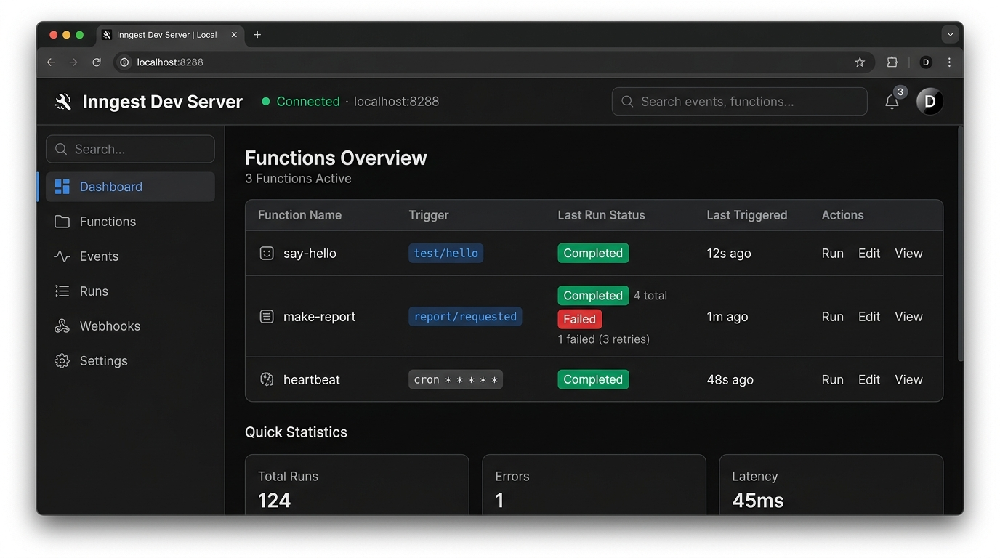

# Week 6 (Assignment A7) - Your First Background Job

> Durable background task execution, event-driven workflows, and scheduled cron jobs leveraging Inngest and FastAPI.

---

## Visual Documentation



---

## Architecture Overview
- **Pattern**: Accept fast (`202 Accepted`), delegate slow execution to an asynchronous background worker, and report status via polling (`GET /reports/{id}`).
- **Workflow Engine**: Inngest orchestrates durable steps (`step.sleep`, `step.run`), automated retries with exponential backoff, and scheduled cron jobs.
- **Dev Server**: Local Inngest engine running at `http://localhost:8288` synchronizing with FastAPI at `/api/inngest`.

---

## Quickstart

### 1. Installation
```bash
uv pip install -r requirements.txt
```

### 2. Start Application Server (Terminal 1)
```bash
uv run --directory . -m main
```
- API Base URL: `http://localhost:8000`
- Health Probe: `http://localhost:8000/health`
- Inngest Endpoint: `http://localhost:8000/api/inngest`

### 3. Start Inngest Dev Server (Terminal 2)
```bash
npx inngest-cli@latest dev -u http://localhost:8000/api/inngest
```
- Inngest Web Dashboard: `http://localhost:8288`

---

## API Endpoints & Background Functions Matrix

### HTTP Endpoints

| Method | Endpoint | Description | Status Code | Expected Body / Response |
|---|---|---|---|---|
| `GET` | `/health` | Application health probe | `200 OK` | `{"status": "ok"}` |
| `POST` | `/reports` | Enqueue report generation job | `202 Accepted` / `400 Bad Request` | Request: `{"topic": "cats"}`<br>Response: `{"id": "<uuid>", "status": "pending"}` |
| `GET` | `/reports/{id}` | Poll report status and results | `200 OK` / `404 Not Found` | `{"id": "<uuid>", "topic": "cats", "status": "done", "result": "..."}` |
| `ALL` | `/api/inngest` | Inngest sync & function execution bridge | `200 OK` / `206 Partial Content` | Managed by Inngest SDK |

### Background Functions

| Function ID | Trigger | Type | Description | Retries |
|---|---|---|---|---|
| `say-hello` | `test/hello` | Event-driven | Introductory durable workflow; sleeps 5s then returns greeting | Default |
| `make-report` | `report/requested` | Event-driven | Durable 2-step workflow (`do-the-slow-work` sleep $\to$ `build-report` compile) | 2 |
| `heartbeat` | `* * * * *` | Cron schedule | Runs every minute on the clock; computes & logs pending/done/failed report counts | Default |

---

## Execution Proof: 202 Accepted & Polling Lifecycle

```bash
# 1. Enqueue report job (returns 202 Accepted in under 50ms)
$ time curl -i -X POST http://localhost:8000/reports \
    -H "Content-Type: application/json" \
    -d '{"topic": "cats"}'
HTTP/1.1 202 Accepted
content-type: application/json

{"id":"9c29806c-f2eb-45ae-952b-bfe896ce1019","status":"pending"}
real    0m0.032s

# 2. Immediate poll returns 'pending'
$ curl -i http://localhost:8000/reports/9c29806c-f2eb-45ae-952b-bfe896ce1019
HTTP/1.1 200 OK
content-type: application/json

{"id":"9c29806c-f2eb-45ae-952b-bfe896ce1019","topic":"cats","status":"pending"}

# 3. Poll after ~10 seconds returns 'done' with generated result
$ curl -i http://localhost:8000/reports/9c29806c-f2eb-45ae-952b-bfe896ce1019
HTTP/1.1 200 OK
content-type: application/json

{"id":"9c29806c-f2eb-45ae-952b-bfe896ce1019","topic":"cats","status":"done","result":"Summary report for topic: cats"}
```

---

## Stages Implemented

### Stage 0: Hello, Server
- Endpoint: `GET /health` $\to$ `{"status": "ok"}`

### Stage 1: Hire the Worker: Connect Inngest
- Client ID: `report-api`
- Function ID: `say-hello`
- Trigger Event: `test/hello`
- Workflow: Sleeps 5 seconds (`ctx.step.sleep("sleep-for-5s", datetime.timedelta(seconds=5))`) then returns `"Hello from the background!"`.

### Stage 2: The Fast Door: Accept Now, Work Later
- **Endpoints**:
  - `POST /reports` $\to$ Returns HTTP `202 Accepted` with `{"id": "<uuid>", "status": "pending"}` in < 1 second.
  - `GET /reports/{id}` $\to$ Returns current status (`pending`, then `done` with `"result"`). Returns `404` for unknown IDs.
- **Workflow**: `make-report` function triggered by `report/requested`.
  - Step 1: `ctx.step.sleep("do-the-slow-work", datetime.timedelta(seconds=8))` (simulates slow task).
  - Step 2: `ctx.step.run("build-report", handler)` (compiles summary and sets status to `"done"`).

### Stage 3: Jobs Fail. Watch the Retry.
- **Durable Failure Handling & Memoization**:
  - `make-report` configured with `retries=2`.
  - Injected failure: If `topic == "fail"`, `build-report` sets status to `failed` and raises `ValueError("The report oven is broken!")`.
  - Because `do-the-slow-work` is a distinct Inngest step, its result is memoized. On retry attempts (1 initial + 2 retries = 3 attempts total), Inngest skips the 8-second wait and immediately retries the failing `build-report` step before marking the run `Failed`.
- **Bad Input vs. Bad Luck (Architectural Reflection)**:
  - Missing or empty topic inputs are rejected immediately at the endpoint with `HTTP 400 Bad Request` without dispatching an event to Inngest or creating a pending report.
  > *"A wrong input must be rejected at the door with HTTP 400 because bad data will never succeed on a retry; only transient failures occurring at a wrong moment deserve automated retries with backoff."*

### Stage 4: The Clock Knocks: Your First Cron Job
- **Scheduled Function**:
  - Function ID: `heartbeat`
  - Trigger: `inngest.TriggerCron(cron="* * * * *")` (runs every minute on the clock).
  - Execution: Aggregates active status counts across `app.state.reports_map` and outputs:
    ```text
    Heartbeat: 0 pending, 1 done, 1 failed
    ```
- **Cron Schedule Analysis**:
  - **Every day at 08:00**: The cron expression is `0 8 * * *`.
  - **Every Sunday at 22:00**: The cron expression is `0 22 * * 0`.

### Stage 5: Publish to GitHub
- Public repository documentation, multi-stage test suite, and verified commit history.

---

## Verification & Automated Tests

Run the complete regression test suite:
```bash
# Run all test suites across Stages 1 through 4
uv run pytest ../tests/test_w6_stage*.py -v
```

Expected output:
```text
tests/test_w6_stage1.py::test_health_endpoint PASSED                     [  7%]
tests/test_w6_stage1.py::test_inngest_registration_put PASSED            [ 14%]
tests/test_w6_stage1.py::test_say_hello_execution_flow PASSED            [ 21%]
tests/test_w6_stage2.py::test_post_reports_instant_202 PASSED            [ 28%]
tests/test_w6_stage2.py::test_get_reports_polling_lifecycle PASSED       [ 35%]
tests/test_w6_stage2.py::test_get_reports_not_found PASSED               [ 42%]
tests/test_w6_stage3.py::test_missing_topic_returns_400 PASSED           [ 50%]
tests/test_w6_stage3.py::test_empty_or_whitespace_topic_returns_400 PASSED [ 57%]
tests/test_w6_stage3.py::test_invalid_payload_type_returns_400 PASSED    [ 64%]
tests/test_w6_stage3.py::test_make_report_retries_configured PASSED      [ 71%]
tests/test_w6_stage3.py::test_fail_topic_raises_error_in_build_report_step PASSED [ 78%]
tests/test_w6_stage4.py::test_heartbeat_cron_trigger_configured PASSED   [ 85%]
tests/test_w6_stage4.py::test_heartbeat_summary_calculation PASSED       [ 92%]
tests/test_w6_stage4.py::test_failed_report_status_tracked_by_heartbeat PASSED [100%]

======================== 14 passed, 1 warning in 0.60s ========================
```
