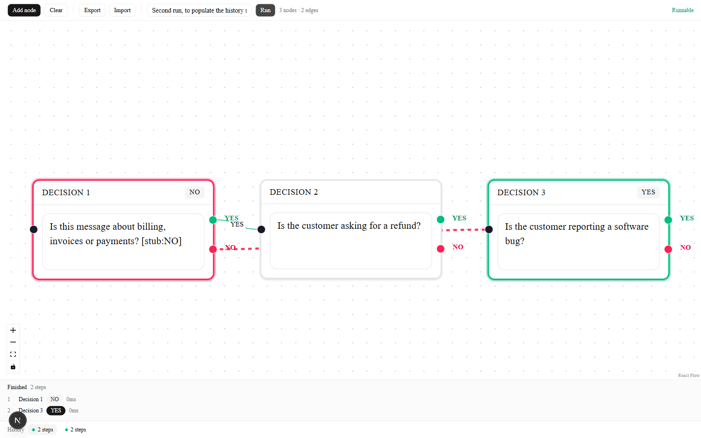

# BE-09 — AI Decision Flow (React Flow + Inngest)

> A visual workflow editor where every node is an AI decision step that returns
> strictly `YES` or `NO`. Execution runs durably through Inngest; the canvas
> visualises the path the run actually took.

**Status: Phase 3 (Build — core) complete.**

---

## Stack

| Concern | Choice |
|---|---|
| Framework | Next.js 16 (App Router) + TypeScript |
| Canvas | React Flow (`@xyflow/react` 12) |
| Workflow engine | Inngest 4 (durable steps, retries, dashboard) |
| Model client | OpenAI SDK 7 against any OpenAI-compatible endpoint |
| UI | Tailwind 4 + shadcn/ui |
| Tests | Vitest (unit · integration · component), Playwright (smoke) |

Next.js rather than plain React because Inngest must be *served* from an HTTP
endpoint — one app gives both the canvas and `/api/inngest`.

---

## Quickstart

```bash
npm install
npx playwright install chromium   # smoke tests only
cp .env.example .env.local
```

Two terminals, one command each:

```bash
# Terminal 1 — the app
npm run dev                     # http://localhost:3000

# Terminal 2 — the Inngest Dev Server + dashboard
npm run inngest:dev             # http://localhost:8288
```

---

## The editor

Open `http://localhost:3000`. Every node is one YES/NO question:

- **Add node** drops a decision on the canvas; type the question straight into it.
- Each node has one **target** handle on the left and two **source** handles on
  the right — green `YES` and red `NO`. Drag from a branch handle to another
  node's target handle to wire the path that branch takes.
- A node cannot have two `YES` branches, and cannot connect to itself; the
  canvas refuses the connection rather than creating an ambiguous graph.
- The toolbar's status shows **Runnable**, or how many issues block a run
  (empty prompt, dangling edge, no single start node).
- The graph is saved to `localStorage` on every change and restored on reload.

### Graph model

Which branch an edge belongs to is carried by React Flow's `sourceHandle`,
which is set to `YES` or `NO` by the handle the user dragged from. Storing the
branch a second time in edge data would let the two disagree.

The start node is the one node nothing points at. A graph with two roots, or a
cycle with none, has no unambiguous place to begin and is reported as invalid.

## Execution

Press **Run**. The endpoint answers `202` immediately with a run id; the walk
itself happens in Inngest, and the UI polls `GET /api/runs/:id` until it settles.

Each visited node becomes one Inngest `step.run`, so a retry replays finished
steps from their saved results instead of paying for them again.



### How a decision is made

The node's prompt and the run input are sent as separate messages — user text
is never concatenated into the system prompt, so a hostile input cannot rewrite
the instructions. `max_tokens` is 10, which makes rambling physically
impossible rather than merely discouraged.

The reply is reduced to a branch by `parseDecision`. A reply containing **both**
YES and NO is treated as no answer rather than taking whichever appeared first —
"yes or no?" is not a decision, and guessing would send the run down a path the
model never chose. One unparseable reply earns exactly one repair attempt, then
the node is reported as undecided and the run fails.

### Guards

| Guard | Why |
|---|---|
| Invalid graph rejected at `POST /api/runs` with `400` | Bad input never becomes valid by retrying, so it must not reach the queue |
| Step id is `node-<id>-<visitIndex>` | A cycle revisiting a node would otherwise reuse an id and replay the first visit's answer |
| `MAX_STEPS = 25` | A looping graph would walk forever, one model call per lap |
| `429` raised as Inngest `RetryAfterError` | Free-tier limits reopen on a timer; retrying in seconds just burns attempts |
| `onFailure` marks the run failed | A provider error escapes the walk, so nothing else would ever move the run off "running" |
| Failed dispatch deletes the run | A "pending" run nothing will advance would be polled forever |

### Provider

`google/gemma-4-26b-a4b-it:free` on OpenRouter. **Not** `openrouter/free`: that
is an auto-router which resolves to a different model per call and currently
lands on a reasoning model that spends its whole token budget before emitting
any content. Measured on the two-case probe, gemma-4-26b returns clean `YES`
and `NO` in ~1.2 s with `finish_reason: stop`.

Free-tier models rate-limit readily. A run that hits `429` on every attempt
ends `failed` with the reason shown in the trace; a paid model removes the limit.

## Endpoints

| Method | Endpoint | Purpose | Codes |
|---|---|---|---|
| `GET` | `/api/health` | Liveness probe; `stub` reports whether a real provider is wired | `200` |
| `GET`·`POST`·`PUT` | `/api/inngest` | Inngest sync + function execution bridge | `200` |
| `POST` | `/api/runs` | Queue a run for a graph + input; answers immediately | `202` · `400` invalid graph · `502` cannot queue |
| `GET` | `/api/runs/:id` | Run status, current node and execution trace | `200` · `404` |

## Background functions

| Function ID | Trigger | Purpose | Retries |
|---|---|---|---|
| `ping` | `flow/ping` | Phase 1 wiring proof — one durable `step.run` | default |
| `run-flow` | `flow/run.requested` | Walks the graph, one `step.run` per visited node; `onFailure` marks the run failed | 2 |

---

## Configuration

OpenRouter, via the OpenAI SDK. Any OpenAI-compatible endpoint works by
pointing `LLM_BASE_URL` at it:

| Variable | Meaning |
|---|---|
| `LLM_API_KEY` | Provider key |
| `LLM_BASE_URL` | OpenRouter · OpenAI · local Ollama — all OpenAI-compatible |
| `LLM_MODEL` | Model id |
| `LLM_STUB` | `1` = scripted decisions, no network, no credits. Used by every test. |
| `INNGEST_DEV` | `1` = local Dev Server (default), `0` = Inngest Cloud |

`.env.local` is gitignored; `.env.example` is the committed template.

---

## Tests

Organised as a pyramid — each phase adds a level and the lower ones stay green.

```bash
npm run test:unit          # pure functions, no I/O
npm run test:integration   # modules together, I/O stubbed
npm run test:component     # rendered UI in isolation
npm run test:e2e           # Playwright, whole app as a user
npm test                   # typecheck + all four, in order
```

---

## Phase 1 proof

`npm run test:e2e`:

```text
Running 3 tests using 1 worker

  ✓  1 tests\smoke\phase1.setup.spec.ts:7:5 › health endpoint answers (33ms)
  ✓  2 tests\smoke\phase1.setup.spec.ts:13:5 › app renders (3.4s)
  ✓  3 tests\smoke\phase1.setup.spec.ts:18:5 › inngest endpoint reports its registered functions (569ms)

  3 passed (15.2s)
```

Live two-terminal run — event dispatched to the Dev Server, function executed
durably, result returned:

```console
$ POST http://localhost:8288/e/dev_key  {"name":"flow/ping","data":{"note":"phase-1-proof"}}
200 {"ids":["01M22WJK0XH1JD0E6RX0E6ERMG"],"status":200}

$ GET http://localhost:8288/v1/events/<id>/runs
t+1s status=Completed

# inngest/function.finished
"function_id": "ai-decision-flow-ping",
"result": { "echoed": "phase-1-proof", "ok": true }
```

---

## Phase 2 proof

`npm test` — the whole pyramid, 47 tests:

```text
> next typegen && tsc --noEmit

> vitest run tests/unit
  Test Files  3 passed (3)
       Tests  24 passed (24)

> vitest run tests/integration
  Test Files  1 passed (1)
       Tests  6 passed (6)

> vitest run tests/component
  Test Files  2 passed (2)
       Tests  8 passed (8)

> playwright test
  ✓  1 phase1.setup.spec.ts › health endpoint answers (32ms)
  ✓  2 phase1.setup.spec.ts › app shell renders (1.9s)
  ✓  3 phase1.setup.spec.ts › inngest endpoint reports its registered functions (21ms)
  ✓  4 phase2.editor.spec.ts › adds nodes from the toolbar (434ms)
  ✓  5 phase2.editor.spec.ts › edits a node prompt (372ms)
  ✓  6 phase2.editor.spec.ts › connects two nodes along the YES branch (651ms)
  ✓  7 phase2.editor.spec.ts › refuses a second edge on the same branch (892ms)
  ✓  8 phase2.editor.spec.ts › reports why an unfinished graph is not runnable (384ms)
  ✓  9 phase2.editor.spec.ts › keeps the graph across a reload (758ms)
  9 passed (8.0s)
```

What each level is responsible for:

| Level | Covers |
|---|---|
| unit | `traverse` · `validate` · `serialize` — branch resolution, dead ends, dangling edges, duplicate branches, start-node ambiguity, round trips, malformed imports |
| integration | `localStorage` round trip, corrupt values, older schema versions, storage unavailable |
| component | `DecisionNode` renders and writes edits back through the React Flow store; `Toolbar` counts and status |
| smoke | Dragging a real connection between handles, refusing a duplicate branch, persistence across reload |

## Phase 3 proof

Live OpenRouter, one graph, two inputs, two different paths:

```text
INPUT  "My invoice was charged twice this month and I want my money back."
POST /api/runs -> 202 {"id":"fbae9d96-…","status":"pending"}
status: done
  step 0  Is it billing?   -> YES  (1 attempt, 2678ms)
  step 1  Refund?          -> YES  (1 attempt,  946ms)

INPUT  "The CSV export button throws a 500 error every time I click it."
POST /api/runs -> 202 {"id":"51a62477-…","status":"pending"}
status: done
  step 0  Is it billing?   -> NO   (1 attempt, 5044ms)
  step 1  Is it a bug?     -> YES  (1 attempt, 1797ms)
```

The second message answered NO at node 1 and was routed down the other edge —
the traversal is decided by the model, not by the graph author.

`npm test` — 81 tests:

```text
> next typegen && tsc --noEmit
> vitest run tests/unit          33 passed
> vitest run tests/integration   23 passed
> vitest run tests/component     13 passed
> playwright test                13 passed
```

| Level | Adds in Phase 3 |
|---|---|
| unit | `parseDecision` (both-answers, neither, fences, punctuation); `buildMessages` keeps user text out of the system prompt |
| integration | Traversal order · NO-branch routing · step-id uniqueness across a cycle · `MAX_STEPS` guard · invalid graph asks the model nothing · repair-then-fail · provider errors propagate · no orphan run on failed dispatch · `POST`/`GET` route contracts |
| component | Run button disabled while busy, while the graph has issues, and on an empty canvas |
| smoke | A graph built in Chrome, executed through a real Inngest Dev Server, branching on each decision |

-09 — AI Decision Flow (React Flow + Inngest)

> A visual workflow editor where every node is an AI decision step that returns
> strictly `YES` or `NO`. Execution runs durably through Inngest; the canvas
> visualises the path the run actually took.

---

## Roadmap

| Phase | Scope | Test levels added |
|---|---|---|
| 1 · Setup | ✅ App, Inngest bridge, env, structure | smoke |
| 2 · Foundations | ✅ Canvas, add/connect nodes, edit prompts, YES/NO edges, local persistence | unit, component |
| 3 · Core | ✅ Node → Inngest step, LLM decision, branch, execution order | integration, E2E |
| 4 · Polish | Execution state, logs panel, JSON import/export, animated edges, retry | full pyramid |
