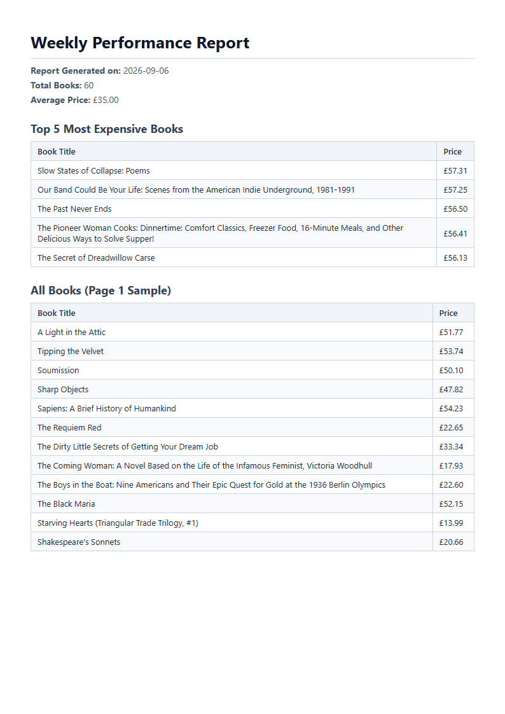

# Week 7 (Assignment A8) - PDF Report Generator

> Production-ready PDF report generation service built with FastAPI, SQLAlchemy AsyncIO, and Playwright. Converts structured relational aggregates into multi-page PDFs with clean print stylesheets, caching, and idempotency guarantees.

---

## Visual Preview



---

## 1. Overview & Dataset

### What It Is
An automated business reporting pipeline that executes analytical aggregation queries against an asynchronous database, compiles the metrics into a styled HTML document with print page-break controls, and renders a multi-page PDF using a headless Chromium browser instance.

Generated documents are persisted to disk and served via dedicated REST API endpoints supporting caching, idempotency guards, and direct binary downloads.

### Dataset Choice: Option B (Bookstore)
- **Source**: Directly seeded from the Week 5 Polite Scraper output (`w5-the-polite-scraper/output/books.json`).
- **Volume**: 60 validated book records across the first 3 catalogue pages.
- **Attributes**: `id`, `title`, `price` (float GBP), `rating` (integer 1–5), and `url`.

---

## 2. Seed & Run Commands

### Installation
```bash
uv pip install -r requirements.txt
uv run playwright install chromium
```

### Seed Database
Seed the SQLite database (`report.db`) with 60 books from the scraper output:
```bash
uv run --directory . python -m scripts.seed_books
```

### Run Server
Launch the FastAPI application server:
```bash
uv run --directory . python -m uvicorn main:app --reload
```
- **Base URL**: `http://localhost:8000`
- **Interactive Documentation (Swagger UI)**: `http://localhost:8000/docs`

---

## 3. Aggregation SQL (Stage 2)

The report executes four analytical queries across the bookstore dataset:

```sql
-- 1. Total number of books
SELECT COUNT(books.id) AS total_books 
FROM books;

-- 2. Average book price
SELECT AVG(books.price) AS average_price 
FROM books;

-- 3. Top 5 most expensive books
SELECT books.title, books.price 
FROM books 
ORDER BY books.price DESC 
LIMIT 5;

-- 4. Number of books grouped by star rating
SELECT books.rating, COUNT(books.id) AS count 
FROM books 
GROUP BY books.rating 
ORDER BY books.rating ASC;
```

### Result Verification Against Dataset
Executing `python -m scripts.queries` yields:
```json
{
    "total_books": 60,
    "average_price": 35.0,
    "top_5_expensive_books": [
        ["Slow States of Collapse: Poems", 57.31],
        ["Our Band Could Be Your Life: Scenes from the American Indie Underground, 1981-1991", 57.25],
        ["The Past Never Ends", 56.5],
        ["The Pioneer Woman Cooks: Dinnertime: Comfort Classics, Freezer Food, 16-Minute Meals, and Other Delicious Ways to Solve Supper!", 56.41],
        ["The Secret of Dreadwillow Carse", 56.13]
    ],
    "books_per_rating": [
        [1, 15],
        [2, 8],
        [3, 13],
        [4, 10],
        [5, 14]
    ]
}
```
*Validation Check*: The sum of books across all rating buckets ($15 + 8 + 13 + 10 + 14 = 60$) equals the total book count ($60$), and the top 5 prices ($56.13$ to $57.31$) fall within the observed range of the scraped dataset.

---

## 4. `curl` Verification Proof

### Step 1: Request Report Generation (`POST /reports`)
```bash
curl -i -X POST http://localhost:8000/reports \
  -H "Content-Type: application/json" \
  -d '{"force": false}'
```

**Response (HTTP 201 Created):**
```http
HTTP/1.1 201 Created
content-type: application/json

{
  "id": "2026-09-06",
  "created_at": "2026-09-06T17:35:48.102314",
  "file": "/reports/2026-09-06/file"
}
```

### Step 2: Retrieve Report Metadata (`GET /reports/{id}`)
```bash
curl -i http://localhost:8000/reports/2026-09-06
```

**Response (HTTP 200 OK):**
```http
HTTP/1.1 200 OK
content-type: application/json

{
  "id": "2026-09-06",
  "created_at": "2026-09-06T17:35:48.102314",
  "file": "/reports/2026-09-06/file"
}
```

### Step 3: Download Generated PDF Binary (`GET /reports/{id}/file`)
```bash
curl -o downloaded_report.pdf http://localhost:8000/reports/2026-09-06/file
```

---

## 5. Stage 4 Reflection: Asynchronous Architecture

> **At what point would you move PDF generation out of the request?**  
> I would move PDF generation out of the synchronous request lifecycle and into an asynchronous background task queue (e.g., Celery, ARQ, or Redis Queue with worker pools) as soon as report generation time exceeds ~1 to 2 seconds, the dataset expands beyond a few hundred records, or concurrent user traffic risks exhausting FastAPI worker processes with memory-heavy headless browser rendering.

---

## 6. Stage 5 Reflection: Idempotency & Real-World Cost

> **What happens if a user submits a duplicate request? What would that cost you in real life?**  
> When a duplicate request is submitted for the same reporting period without the `force: true` override, the API detects the existing database record and returns `HTTP 200 OK` pointing to the pre-rendered PDF rather than triggering another rendering cycle. In real-world production, handling duplicate requests naively would cause unnecessary CPU and memory spikes from spawning headless browser instances, trigger repeated read loads on production databases, and drive up cloud compute, storage, and bandwidth costs while increasing the risk of denial-of-service for other API consumers.

---

## 7. Automated Test Suite

Execute the full Stage 1–5 test suite:
```bash
uv run --directory . pytest ../tests/test_w7_2_stage1.py ../tests/test_w7_2_stage2.py ../tests/test_w7_2_stage3.py ../tests/test_w7_2_stage4.py ../tests/test_w7_2_stage5.py -v
```
